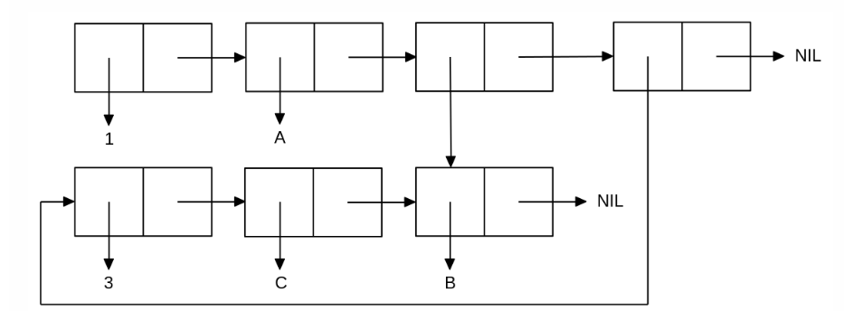

<p align="center"><b>МОНУ НТУУ КПІ ім. Ігоря Сікорського ФПМ СПіСКС</b></p>

<p align="center">
<b>Звіт з лабораторної роботи 1</b><br/>
"Обробка списків з використанням базових функцій"<br/>
дисципліни "Вступ до функціонального програмування"
</p>

<p align="right"><b>Студент</b>: Луценко Б. А.<p>
<p align="right"><b>Група</b>: КВ-13<p>
<p align="center"><b>Рік</b>: 2024</p>

<div style="page-break-after: always;"></div>

## Загальне завдання

1. Створіть список з п'яти елементів, використовуючи функції LIST  і CONS . Форма створення списку має бути одна — використання SET  чи SETQ  (або інших допоміжних форм) для збереження проміжних значень не допускається. Загальна кількість елементів (включно з підсписками та їх елементами) не має перевищувати 10-12 шт. (дуже великий список робити не потрібно). Збережіть створений список у якусь змінну з SET  або SETQ . Список має містити (напряму або у підсписках):
    - хоча б один символ
    - хоча б одне число
    - хоча б один не пустий підсписок
    - хоча б один пустий підсписок
2. Отримайте голову списку.
3. Отримайте хвіст списку.
4. Отримайте третій елемент списку.
5. Отримайте останній елемент списку.
6. Використайте предикати ATOM  та LISTP  на різних елементах списку (по 2-3 приклади для кожної функції).
7. Використайте на елементах списку 2-3 інших предикати з розглянутих у розділі 4 навчального посібника.
8. Об'єднайте створений список з одним із його непустих підсписків. Для цього використайте функцію APPEND

```lisp
;; Setting the list with values
(defparameter my-list '(a1 b1 c1 123 0.1 3/4 ("text" a2 b2 c2) () (nil) 99))

;; Verifying the list
my-list

;;; Getting list's head
;; Method 1
(car my-list)
;; Method 2
(first my-list)

;;; Getting list's tail
;; Method 1
(cdr my-list)
;; Method 2
(rest my-list)
;; Method 3. Redundant, but may be useful is some cases
(nthcdr 1 my-list)

;;; Getting third elem of the list
;; Method 1
(third my-list)
;; Method 2
(nth 2 my-list)
;; Method 3. Redundant and NOT useful. Only for research purposes
(second (cdr my-list))
(second (rest my-list))
(car (cdr (cdr my-list)))
(first (cdr (cdr my-list)))

;;; Getting the last elem of the list
;; Method 1
(car (last my-list))
;; Method 2. Redundant, but allows to get n-th elem from the end, although may be useful
(nth (1- (list-length my-list)) my-list)

;;; 'atom' & 'listp' usage
;; 'atom'
(first my-list)
(atom (first my-list))

(first (nth 6 my-list))
(atom (first (nth 6 my-list)))

(nth 6 my-list)
(atom (nth 6 my-list))

;; 'listp'
(nth 3 my-list)
(listp (nth 3 my-list))

(nth 6 my-list)
(listp (nth 6 my-list))

(nth 7 my-list)
(listp (nth 7 my-list))

(nth 8 my-list)
(listp (nth 8 my-list))

;;; Usage of another predicates
;; 'eq'
(eq (second (cdr my-list)) (first (cdr (cdr my-list))))
;; 'evenp' & 'oddp'
(nth 3 my-list)
(evenp (nth 3 my-list))
(oddp (nth 3 my-list))

(car (last my-list))
(evenp (car (last my-list)))
(oddp (car (last my-list)))

;;; Appending original list with its not empty sub-list
my-list
(append my-list (nth 6 my-list))

(eq (nth 6 my-list) (nthcdr 10 (append my-list (nth 6 my-list)))) ; T
                                                                  ; As we can see, these objects are the same, 
                                                                  ; that means that by appending inner list
                                                                  ; to the outer list we just created a reference
                                                                  ; at the end of the list to the inner list
```

## Варіант 11(3)
<p align="center">

</p>

```lisp
;;; Task for variant:
(rem 11 8) ; 3

(defparameter super-list-bottom '(3 c b))
(defparameter super-list-full (list 1 'a (nthcdr 2 super-list-bottom) super-list-bottom))

super-list-full ; (1 A (B) (3 C B))

;; Check if 'B' is the same cell by changing it from 'b' to 'bb'. CAUTION: destructive behavior. Only for research purposes
(rplaca (last super-list-bottom) 'bb)

super-list-full ; (1 A (B) (3 C B))
```
